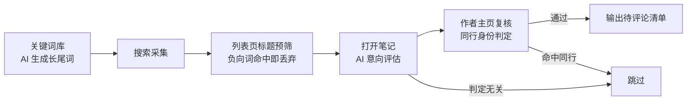
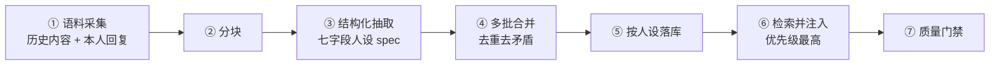
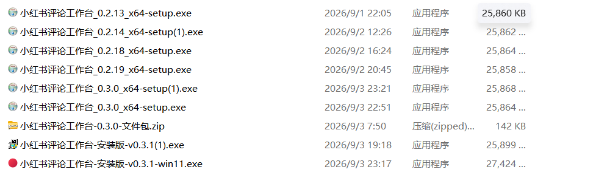

# 社媒 AI 获客评论工作台

> Windows 桌面应用 · 独立设计 + 主导实现（AI 协作开发）
> Node.js · Playwright · DeepSeek API · Python · NSIS

## 一、解决什么问题

在社媒平台做垂直领域获客，最耗时的是三件事：

1. **找词**——什么词能搜到真正的潜在客户，而不是同行？
2. **筛人**——搜出来的一堆笔记里，哪些是同行写的科普，哪些是真的在求助？
3. **写话**——每条评论都要像真人说的，不能是复制粘贴的模板。

原来这三件事全靠人工，一人一天做不了多少条。这个工作台把它们做成了**一条可挂机运行的流水线**。

## 二、核心设计：多层判定漏斗

**逐层过滤的价值**：把最贵的动作（打开笔记、调用大模型）放在最便宜的规则之后。先用关键词和标题负向词砍掉大部分噪音，AI 只需要评估真正有价值的少数笔记，成本与耗时同步下降。

## 三、提示词设计（我的核心工作）

这个项目的技术搭建由我完成，但**三类 AI 任务的 Prompt 策略全部由我设计**，这也是我投入最多的地方：

| AI 任务 | 设计要点 |
|---|---|
| 搜索词生成 | 把模型角色从「销售视角」改为「买家视角」，并给出正例清单 + **明确反例**（严禁出现"配置/测评/榜单/推荐"这类同行词），生成结果才是真实用户在搜的词 |
| 笔记意向评估 | 用结构化输出（JSON）约束返回格式，让判定结果可被下游程序直接消费；同时约束模型只看用户表达的真实困扰，不因"提到保险"就判为意向 |
| 同行身份判定 | 分两级：先走规则强信号（简介/昵称中的从业特征词），再走 AI 复核，兼顾速度与准确率 |
| 评论内容生成 | 用角色设定 + 语气约束 + 长度约束，让输出贴近真人表达 |

**迭代方式**：不凭感觉改。每次上线后看两件事——**判错的案例**和**漏判的案例**，把案例回溯成规则或反例写进 Prompt，再跑一轮对比。项目累计迭代了 25 个版本，完整记录见 [CHANGELOG-全量迭代记录.md](CHANGELOG-全量迭代记录.md)。

## 四、知识注入链路：让 AI 写出「像本人说的话」

只靠提示词里的形容词（「专业」「亲切」）是约束不住输出的——同一个工具给不同同事用，写出来的味道一模一样。

所以我单独做了一条**知识注入链路**：读取某个社媒账号的历史内容与本人评论回复 → 分块 → 蒸馏成固定七字段的「人设 spec」→ 多批结果合并去重 → 按人设维度落库 → 生成内容时自动检索并注入提示词（优先级最高）→ 过输出质量门禁。

这条链路与标准 RAG 的差别、以及哪些环节我确实没做过，写在专门的技术文档里逐条对照：

- 🔗 [技术方案 · 知识注入与检索链路](技术方案-知识注入与检索链路.md)

## 五、一个关键的方案决策：把全自动改成半自动

**初版设计是全自动**——浏览、筛选、评论、回复全部由程序完成。

**试运行 1 天后触发了平台的风控预警。** 当天我做了判断：

- 风险最高的是「评论」和「回复」这类**对外的写入动作**，它直接代表账号在平台发言；
- 「浏览」和「采集」属于读取，平台最严厉的处置措施也不会限制用户浏览内容。

**于是把方案重构为半自动**：工具只承担浏览与信息采集，评论和回复回归人工。带来两个直接好处：

1. 工具可以用一枚**非核心账号**稳定运行，不再需要拿主力账号冒险；
2. 即便这枚账号被限制，**读取链路依然走得通**，整条流程不会中断。

**结论**：用「主动退一步」的设计把风险敞口压到最低，换取整条流程长期可跑通——这是我在这个项目里最看重的一次工程判断。

## 六、工程实现

- **模块化架构**：每个功能独立成模块文件，主文件只负责统一调用。核心模块包括 `engine.js`（流程引擎）、`ai.js`（模型调用）、`filters.js`（规则过滤）、`kw-default.js` / `kw-custom.js`（词库双模块）、`profile-peer.js`（同行复核）、`browser.js`（浏览器控制）。
- **交付形态**：用 NSIS 打包成 exe，非技术同事双击即用，无需安装环境。
- **可维护性**：每个版本都写 CHANGELOG（改了什么、为什么改、影响范围），并单独产出了[代码模块规范](代码模块规范.md)，方便交接。
- **需求与验收**：需求定义、功能边界、硬性约束、参数化档位设计与验收标准，整理在[需求设计说明](需求设计说明-约束与验收标准.md)。
- **效果评测**：为 AI 判定层建立评测口径与指标（**优先盯误杀率**，而不是准确率）、分层抽样、badcase 归因到可改动作，并用同一评测集做改动前后的回归对比。→ [效果评测 · 首轮基线](效果评测-首轮基线.md)
- **版本留档**：每个版本都打出安装包并留档，任意一版都能回溯到实际产物（下图是本地保留的部分版本）。

## 七、说明

- 本目录公开的是**项目说明、架构文档与完整迭代记录**。应用源码与词库、人设配置未公开，原因是其中包含个人业务数据与第三方服务配置。
- **关于开发方式，需要如实说明**：本项目采用 AI 协作开发。我负责**需求定义、方案拆解、提示词设计、验收测试与迭代排错**；代码由 AI 编程工具生成。**我不具备手写代码的基础**——我的价值在于把需求描述清楚、判断 AI 产出对不对、并驱动它把问题修到能跑。
- 所以这里不适合「逐行讲代码」的演示，但可以**现场演示工具的完整操作流程与实际运行效果**，也可以讲清楚每一个设计决策背后的取舍（比如为什么把全自动改成半自动）。
