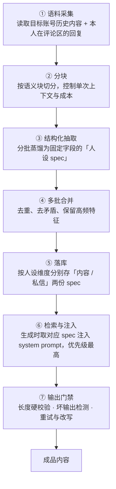

# 技术方案 · 知识注入与检索链路

> 让 AI 写出「像本人说的话」，而不是「像 AI 写的话」
>
> 配套项目：[社媒 AI 获客评论工作台](README.md) ｜ 迭代记录：[CHANGELOG-全量迭代记录.md](CHANGELOG-全量迭代记录.md)

---

## 一、要解决的问题

用通用提示词让模型写专业内容，专业度是够的，但有两个绕不过去的问题：

1. **写出来不像人。** 同一个工具给不同同事用，产出的味道一模一样。把「当前评论风格」写成「专业、笃定、说人话」，模型每次发挥都不一样——形容词约束不了输出。
2. **换个人就得重调。** 想让输出贴近某位具体同事的口吻，只能人工反复改提示词，改到像为止。成本极高，且不可复现。

真正缺的不是更好的形容词，而是**这个人的真实语料**，以及一套**把语料变成可复用知识的流水线**。

我搭的这条链路就是解决这件事：给定一个社媒账号，把它的历史内容自动读下来，蒸馏成一份结构化的人设 spec；之后每次生成内容时，自动把这份 spec 检索出来注入提示词。

## 二、整体链路

## 三、逐步拆解

### ① 语料采集：取真人语料，且要取「对话场景」的语料

语料不能随便抓，两个判断：

- **要抓本人写的，不要抓转载和科普。** 正文里的通用保险知识对「说话风格」没有贡献，反而会污染。
- **要抓评论区回复。** 同一个人在正文里和在评论区回复用户时，用词完全不一样——回复是即时的、口语的、带情绪的，这才是最地道的风格样本。所以采集时会单独把**作者本人在评论区的回复**捞出来，和正文分开标注。

采集本身用浏览器自动化完成：按账号定位主页 → 滚动加载 → 逐篇打开 → 读取内容与本人回复，全程模拟正常浏览节奏。

### ② 分块：控制单次上下文与成本

语料可能有几十篇，一次塞进模型会超上下文且贵。做法是：

- 以**空行分隔的语义块**为最小单位，按固定条数聚合成批（每批约 12 块）；
- 批次总量超过上限（40 批）时**等距采样**——不是随意丢弃，是均匀抽，保证风格特征不被某一时段的内容偏置。

### ③ 结构化抽取：把语料压成一份人设 spec

这一步的产出**必须结构化**，否则没法复用。抽取出的 spec 固定包含七个字段：

| 字段 | 内容 |
|---|---|
| 人设定位 | 这个人是谁、以什么身份、什么口吻说话 |
| 开场习惯 | 通常怎么开头（共情 / 喊停 / 提问 / 直接给结论），附典型句式 |
| 惯用句式与结构 | 最标志性的句法或框架，附 1–2 个模板句式 |
| 用词与语气 | 口语还是书面、是否用行业词、语气强弱、标点习惯 |
| 收尾方式 | 把决定权交回用户？自然带出建议？留口子？ |
| DO / DON'T | 各 3–5 条可操作的正负向规则 |
| 样例（few-shot） | 2–3 条「场景 → 示范输出」 |

**两个关键设计**：

- 明确要求「**只萃取可迁移的语言风格，不照搬具体知识点、产品名、价格或某个案例的事实**」——防止把语料的业务内容当成风格一起搬进来。
- 明确要求「**用可核对的行为规则 + 样例，而不是『温柔』『亲切』这类形容词**」。这是整条链路最关键的一条约束：形容词不可验证，行为规则和样例可验证。

### ④ 多批合并：去重、去矛盾、保留高频

多批蒸馏会得到多份局部结论，彼此可能重复甚至冲突（一批说「习惯先共情」，另一批说「习惯先给结论」）。

所以要有第二轮：把 N 份结果**再合成一份统一 spec**，规则是「保留出现频率高、代表性强的特征，丢弃偶发或矛盾项」。这一步不做，最终人设就是自相矛盾的。

这就是典型的 map-reduce 式知识整合——先并行抽取，再合并归约。

### ⑤ 落库：按人设维度分开存

最终 spec 不是存一份通用文件，而是**按人设维度落库**，且把「写内容」和「发私信」两份分开——同一人在这两个场景的语气并不相同，混用会失真。

### ⑥ 检索与注入：生成时把对应 spec 取出来，且优先级最高

这是整条链路最容易被忽略、但在工程上最重要的一环：

- 生成前，按当前选中的人设**取出对应的 spec**；
- 把 spec 拼进 system prompt；
- 并显式声明**优先级最高——与通用规则冲突时，以人设 spec 为准**。

没有这个优先级声明，人设会被通用规则稀释掉，等于白做。

### ⑦ 输出门禁：生成之后还有一道关

模型输出不可信，所以生成完必须过检查：

| 门禁 | 动作 |
|---|---|
| 长度硬校验 | 超出上限 → 在最近句末标点处截断；不足下限 → 带「请补充实质内容」重写一次 |
| 坏输出检测 | 语言错乱（中文里混入大量西文）、复读错误串、半截代码块 → 判定失败，换低温度重写 |
| 截断重试 | 因长度被截断 → 降低温度、加长 token 上限重跑一次 |
| 兜底 | 重写仍不合格 → 直接丢弃该条，不把废料放进结果 |

## 四、一条已经下线的实现：案例记忆检索注入

在这条链路之外，还做过一版**更接近标准 RAG 形态**的实现，后来被主动下线了。如实记录在这里。

**做法**：把「判断这篇笔记的作者是不是同行」这个动作，做成一个自学习闭环——

| 环节 | 实现 |
|---|---|
| 记忆写入 | 每次 AI 识别出同行，自动把案例（作者昵称 / 标题 / 识别理由）写入记忆文件 |
| 容量控制 | 滑动窗口，只保留最近 **30 条**——防止旧案例无限膨胀，也避免早期误判长期污染后续判断 |
| 检索 | 下一次评估前，取回历史同类案例 |
| 注入 | 把案例作为参考拼进评估提示词，相当于给模型一批「历史上这种情况就是同行」的锚点 |
| 效果 | **越跑越准**——同类同行第二次出现时，不必完全依赖模型重新推理 |

和第三节那条链路相比，这一版的检索环节更接近标准 RAG：它有了**持续的写入**和**跨任务的记忆积累**，而不是一次性蒸馏出静态 spec。

**为什么下线**：这不是某个功能被单独删掉。后续多个改动叠加之后引入了新问题，我当时的判断是「**基准被污染了**」——与其在一个已经偏移的版本上继续打补丁，不如把整条主流程**整体回退到经过验证的基线版本**：期间所有改动一并移除，只保留两处确认必要的接线。案例记忆注入就在这批回退里。

**我怎么看这件事**：这条链路的形态是对的（写入 → 检索 → 注入 → 反馈），但它当时和另外几个改动绑在一起，**无法单独验证收益和风险**。所以我的选择是整体回退、保住稳定基线，而不是为了留一个亮点去承担不可控的回归风险。

**现状**：当前代码中**不存在**该功能（运行期间产生过真实的案例记录文件，随下线一并停止写入）。写在这里，是因为它确实实现过、也确实跑出过数据，也是我对「检索增强」理解最完整的一次实践——**包括它该被下线的那次判断**。

## 五、技术选型说明

这条链路里有两个关键选型，都是**按场景定的**。

### 1. 检索用「按人设键值定位 + 关键词规则召回」

这个场景的检索需求其实很窄：不是「在海量文档里找最相关的几段」，而是两件事——

- **准确取出当前这个人设对应的那一份 spec**（人设是确定的，不存在模糊匹配的必要）；
- **判断一篇笔记的标题/正文是否属于求助语义**（判定标准是可枚举的，可以写成明确的规则）。

这两件事都不需要模糊召回，反而要求**命中即确定、可解释、可回溯**：判错了能立刻定位到是哪条规则、哪个人设出的问题，而不是只能对着一串相似度分数猜为什么。同时它不需要引入额外的向量库依赖，整条链路的运行成本和排障难度都低一个量级。

### 2. 规则在前、模型在后，把最贵的动作放到最后

采集一批笔记，如果每条都交给模型判断，成本和耗时都不可接受。所以链路顺序是**便宜的规则在前、贵的模型在后**：能用关键词和结构化字段干净砍掉的一律不调模型，模型只处理真正拿不准的少数。

这也是第三节那条判定漏斗的整体思路，以及第四节那版记忆库要解决的同一个问题——**让模型处理的问题越来越少、越来越准**。

### 3. 选型的共同标准

在这个规模下，**可控和可解释比极限召回率更值钱**：需求本身是确定的、判定标准是可枚举的，那就用能做确定答案的手段，把不确定性留给真正需要模型的那一小部分。

## 六、这套方法能迁移到哪

这条链路的本质是「**把某个人的真实表达，变成可复用的生成约束**」，所以它不局限在保险获客场景：

- 品牌 / 门店的统一口吻：把历史最佳回复蒸馏成 spec，多人共用不漏风格
- 客服与销售话术库：从金牌客服的真实聊天记录里抽取，而不是拍脑袋写 SOP
- 个人 IP 内容风格固化：换人接手也能写出同一个味道
- 任何有历史语料积累的垂类场景

## 七、公开范围说明

本仓库公开的是**方法与链路**。以下内容不在公开范围：

- 具体提示词原文、人设 spec 的实际内容与词库
- 规则层的关键词表、判定正则与特征规则
- 浏览器的具体节奏参数与账号运营细节

这些是本项目的核心资产，也是个人业务数据所在，面试时可现场演示讲解。
