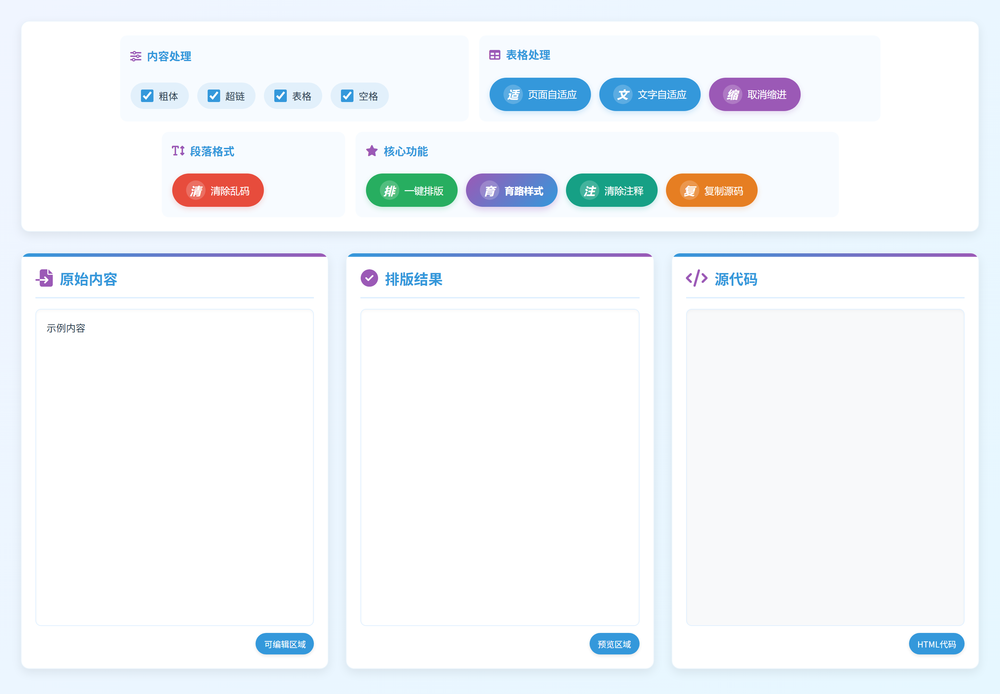
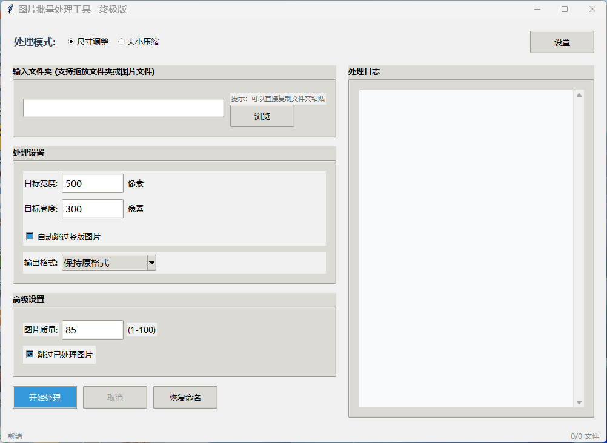
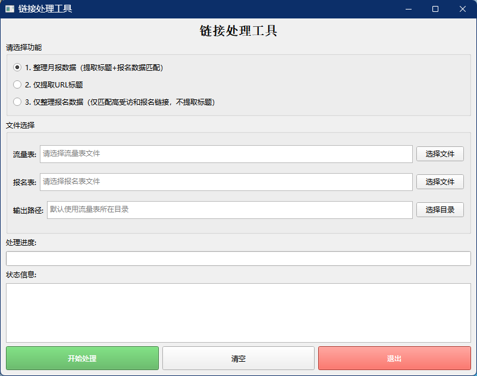
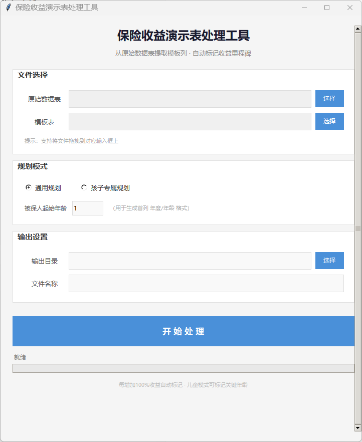

# 04 · 公司内部效率工具（在职期间自研并投入使用）

这四个工具不是课程作业或练手项目——都是我在公司任职期间，因为自己或同事每天都在受这个问题的折磨，自己提出来、自己设计并做出来的，做完后直接投进日常使用，同事也在用。

> **说明**：这四个属于「用现成手段解决具体业务问题」的内部工具，和前面 01–03 的 AI 协作开发项目不是同一类。文件在此仅作个人作品留档，工具本身服务于当时的公司业务，请勿作商业用途。

---

## 1. 一键排版工具（网页版，单文件）

**要解决的问题**
日常要从飞书云文档把内容复制到网站后台（帝国 CMS）发布。直接粘贴过去，加粗、超链、表格、段落缩进全丢，还夹着一堆乱码字符，一篇稿子要手工修 5~10 分钟。一天发十几篇，光排版就吃掉大半个上午。

**我做了什么**
把它做成一个三栏的网页工具：左边贴原始内容，中间实时预览排版结果，右边直接出可复制的 HTML 源码。

- **核心功能**：一键排版、清除乱码、清除注释、复制源码
- **表格处理**：页面自适应、文字自适应、取消缩进（针对后台编辑器会撑破布局的问题）
- **内容处理**：粗体、超链、表格、空格的可选开关
- **样式预设**：把目标后台的排版样式固化成预设，一键套用

**结果**
单篇排版从 5~10 分钟压到秒级。因为同事也在用，后来把它推进到了公司流程里。

**它是怎么从「一个人的工具」变成「团队在用的工具」的**

工具最初只是我给自己写的一个单文件网页——贴入、排版、复制源码，全程离线。同事看到在用也过来要，就变成了小范围共用。

但要真正落到公司流程里，卡点在两件事上：**一是入口**——同事得先知道去哪找这个文件、再单独打开；**二是后台侧的配合**——排版结果要能直接喂给网站管理后台，最好在后台里就能调用。

于是我做了三件事：

1. **和技术人员确认接入方式**：把工具接进网站管理后台需要后台侧留出入口。我负责把工具的调用方式、依赖情况（纯前端、无外部请求、不引入第三方库）和改动范围讲清楚，让技术能直接评估工作量，不用来回猜。
2. **和编辑同事对齐真实场景与验收标准**：他们日常发的是哪几类稿子、哪些格式最容易出问题、什么情况算「排版通过」。这些反馈直接决定了工具有哪些开关、样式预设怎么定——不是我自己拍脑袋想的。
3. **按反馈改到能直接用**：编辑提的问题就是下一版的改动项，改完再让他们跑一遍验收。

最后它作为工具入口落进了公司网站管理后台，编辑同事在发布流程里直接调用，不用再单独开一个文件。

**形态**：单个 HTML 文件（原生 JS），双击浏览器打开就能用，不需要安装、不需要联网。

---

## 2. 图片批量处理工具（Windows 桌面）

**要解决的问题**
网站配图要按规格统一处理尺寸和体积。过去同事一张张丢进 PS 处理，一次几十上百张，要花 5 小时左右，而且尺寸和压缩质量全凭手感，不同人做出来不统一。

**我做了什么**
一个可拖放的批量工具，两种处理模式：

- **尺寸调整**：设定目标宽度 / 高度，自动跳过竖版图片（避免把竖图压扁）
- **大小压缩**：按质量参数压缩体积
- 可选输出格式（保持原格式 / 另存）、图片质量（1–100）
- **跳过已处理图片**：中断后重跑不会重复处理
- **恢复命名**：处理过程中改了名也能还原
- 右侧实时处理日志，状态栏显示当前进度

**结果**
同样的工作量从 5 小时缩到 1 分钟以内，而且输出规格统一，从此不依赖某个人会 PS。

**形态**：Python + tkinter 打包成的单文件 exe，同事双击即用，不需要装 Python 环境。

---

## 3. 月报数据处理工具（Windows 桌面）

**要解决的问题**
每月出数据报表时，要把「流量表」和「报名表」按页面链接对起来，再逐条去打开链接、把页面标题抄回来。两张表少则几百行，人工比对又慢又容易错位，一旦对错一行，后面整个报表都歪了。

**我做了什么**
一个按链接自动匹配的处理工具，三种模式可选：

- **整理月报数据**：提取标题 + 报名数据匹配（完整流程）
- **仅提取 URL 标题**：只要标题时用
- **仅整理报名数据**：只匹配高意向和报名链接、不取标题

输入流量表与报名表，指定输出目录（默认跟流量表同目录），一键处理后输出结果；处理有进度条，异常会在状态信息里说明原因，不会静默失败。

**结果**
「人工逐行比对两张表 + 逐条打开链接抄标题」这个流程变成一次点击完成，也不会再出现对错行的情况。

**形态**：Python 打包成的单文件 exe（内含链接标题抓取）。

---

## 4. 保险收益演示表处理工具（Windows 桌面）

**要解决的问题**
做客户方案时，每个客户的收益演示表都要重新整理一遍：按被保人年龄生成「年度/年龄」首列、按交费年限对应封闭期、把收益里程碑标出来、再套上统一的模板格式。一个客户要处理半天，一个月几十个客户——同事几乎每天都要耗在这上面，而且纯手工做容易漏标、不同人做出来格式还不统一。

**我做了什么**
把「原始数据表 + 一份模板表」作为输入，自动完成整条处理：

- **从模板表提取列结构**：以后换表格不用改代码，换一份模板表就能适配——这是这个工具能一直用下去的关键
- **自动生成「年度 / 年龄」首列**：按被保人起始年龄推算，分「通用规划」与「孩子专属规划」两种模式
- **自动标记收益里程碑**：每增加 100% 收益打一个标记；儿童模式额外标记关键年龄
- **输出目录与文件名可自定义**，也支持把文件直接拖到输入框上——不要求使用者懂路径

**结果**
原来一个客户方案要手工处理半天，现在「选原始表 + 选模板表 → 点开始处理」几秒出结果，而且多个客户之间格式完全统一，不会再漏标。同事几乎天天在用。

**形态**：Python + tkinter 打包成的单文件 exe，双击即用。

---

## 一点补充

这四个工具的共同点是：**都是从「每天真实存在的重复劳动」出发的**。它们的价值不在于代码多复杂，而在于做完之后同事确实在用、确实省下了时间——这也是我做工具的习惯：先看哪一步最费人，再想能不能让它自动化。
