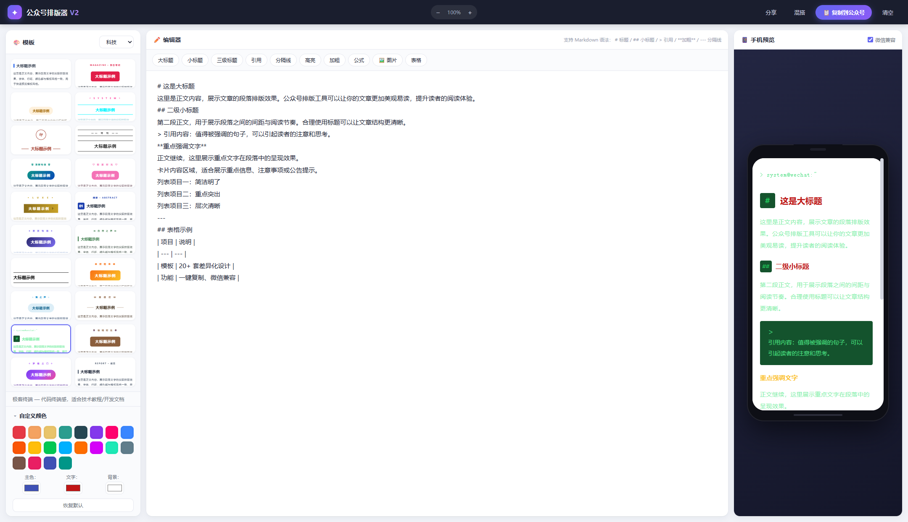

# AI 应用作品集 · 王岩

> 7 年互联网内容运营经验 + 近 2 年 AI 落地实战。
> 从**提示词设计**出发，独立打通「AI 生成内容 → 自动化流程 → 可交付工具」的完整闭环。

📮 **83948041@qq.com**

---

## 项目一览

| # | 项目 | 形态 | 我的角色 | 状态 |
|---|---|---|---|---|
| 01 | 社媒 AI 获客评论工作台 | Windows 桌面应用 | 独立设计 + 主导实现 | 内部投用中 |
| 02 | 客户福利抽奖 H5 | 微信内网页 | 独立设计 + 主导实现 | 已上线运行 |
| 03 | 保险需求诊断小程序 | 微信小程序 | 产品设计 + 主导实现 | 已上线运行 |
| 04 | 公司内部效率工具（4 个） | 单文件网页 / Windows 桌面 | 独立设计 + 主导实现 | 在职期间内部投用 |
| 05 | 公众号排版器（思路 Demo） | 单页网页 | 思路验证 + 独立设计 | 思路 Demo，未上线 |

> **关于我的角色，先如实说明**：
>
> **01–03** 这三个 AI 项目都采用 **AI 协作开发**方式。我负责**需求定义、方案拆解、提示词设计、验收测试与迭代排错**，代码由 AI 编程工具生成。我不具备手写代码的基础，我的能力在于把需求讲清楚、判断 AI 产出对不对、并驱动它迭代到能跑。因此这里展示的是**设计思路、决策过程与迭代记录**，不是代码本身。
>
> **04** 则是更早时期在公司内部做的效率工具，属于「用现成手段解决具体业务问题」这一类，与 01–03 不是同一类型，一并放在这里是为了留档。
>
> **05** 是一次个人做的**思路验证 Demo**，同样是 AI 协作开发方式。它的定位是「验证思路」，明确**不是成品**——说明里写清楚了它证明了什么、没做什么。

---

## 01 · 社媒 AI 获客评论工作台

**一句话**：把「找精准用户 → 判断是否同行 → 写出像人说的话」这条链路，做成一键运行的桌面工具。

**技术栈**：Node.js · Playwright · DeepSeek API · Python（文档生成）· NSIS（打包）

**执行方案**：

- **多层判定漏斗**：先用关键词与结构化字段砍掉噪音，只把真正拿不准的少数交给模型判断——把最贵的动作放到最后，成本与耗时同步下降。
- **知识注入链路**：读取目标账号的历史内容与其本人在评论区的回复 → 分块 → 蒸馏成固定七字段的人设 spec → 多批结果合并去重 → 生成时按人设检索注入 → 过输出质量门禁。解决的问题是：不同同事用同一套工具，也能各写各的口吻，而不是一模一样的机器味。
  → [技术方案 · 知识注入与检索链路](01-xhs-workbench/技术方案-知识注入与检索链路.md)
- **需求与边界定义**：功能范围、硬性约束（内容长度 / 合规红线 / 风险边界）、参数化档位设计（三档强度，每档封装四个参数）、验收标准与迭代回归机制。
  → [需求设计说明 · 约束与验收标准](01-xhs-workbench/需求设计说明-约束与验收标准.md)
- **效果评测闭环**：给 AI 判定层定义评测口径与指标——**优先盯误杀率而不是准确率**（误杀真客户不可逆、放进同行只是多花一次力气）；分层抽样 → 独立标注 → 只仲裁分歧 → badcase 归因 → 用同一评测集做改动前后回归。
  → [效果评测 · 首轮基线](01-xhs-workbench/效果评测-首轮基线.md)

**结果**：累计迭代 25 个版本；交付形态是双击即用的 exe，非技术同事无需安装环境；把对外发布的动作保留给人工、工具只承担读取与采集，用一枚非核心账号即可长期稳定运行。

- 🔗 [项目说明（含提示词设计思路与完整迭代记录）](01-xhs-workbench/README.md)

---

## 02 · 客户福利抽奖 H5

**一句话**：面向微信传播的客户福利抽奖活动页，含奖池逻辑、表单收集与分享卡片，独立部署上线运行。

**技术栈**：原生 HTML/CSS/JS · 腾讯云静态托管 · 微信分享卡片（og:image）

- 🔗 [项目说明](02-lottery-h5/README.md)

---

## 03 · 保险需求诊断小程序

**一句话**：面向销售面谈现场的需求测算工具，覆盖**重疾险保额缺口**与**养老金缺口**两类模型，测算结果与公司计划书逐项核对、精确到元。

**技术栈**：微信小程序原生 · 需求建模 · 精度校验

- 🔗 [项目说明](03-insurance-miniprogram/README.md)

---

## 04 · 公司内部效率工具（4 个）

在职期间自己提出需求、自己做完、同事直接在用的小工具。都不是玩具项目——每一个都是从「每天都在重复的体力活」出发的。

| 工具 | 解决的问题 | 结果 |
|---|---|---|
| **一键排版工具**（单文件网页） | 飞书文档贴到网站后台，格式全丢 + 夹乱码，一篇手工修 5~10 分钟 | 单篇压到**秒级**；后与技术人员、编辑同事协作，**把工具接进了公司内部的网站管理后台** |
| **图片批量处理工具**（桌面应用） | 同事用 PS 逐张处理配图，一次要 5 小时 | 缩到 **1 分钟以内**，输出规格统一 |
| **月报数据处理工具**（桌面应用） | 流量表与报名表按链接人工比对 + 逐条抄标题，易错行 | 从人工比对变成**一次点击** |
| **保险收益演示表处理工具**（桌面应用） | 每个客户方案都要手工整理收益演示表：生成年度/年龄列、对应封闭期、标收益里程碑、套统一格式，一个客户半天 | **几秒出结果**，多客户格式统一不再漏标；同事几乎天天在用 |

**跨团队推进的过程**：一键排版工具最初只是我给自己写的一个单文件网页。要让它从「一个人的工具」变成「团队在用的工具」，就得接进公司网站管理后台——这涉及后台侧的改造，也涉及编辑同事的使用习惯。

我做的是三件事：和技术人员确认接入方式与改动范围、和编辑同事对齐真实排版场景与验收标准、然后把工具按他们的反馈改到能直接用。最后它作为工具入口落进了后台，编辑同事在流程里直接调用，不用再单独开一个文件。

- 🔗 [四个工具的说明与界面截图](04-work-tools/README.md)（含可运行文件）

---

## 05 · 公众号排版器（思路 Demo）

**一句话**：一次思路验证——用「色板 + 结构组件」的模板结构解决模板同质化的问题，用「预览态 / 交付态分离」解决「排好的版一粘贴到公众号就丢样式」的问题。

**技术栈**：原生 HTML/CSS/JS · 自研模板引擎 · Clipboard API

**执行方案**：

- **模板引擎的抽象**：模板不再是一份写死的样式表，而是拆成「色板」+「结构组件」两层。颜色全部用占位符引用色板，换一个主色整套模板联动；视觉差异化来自结构变体（色块条 / 气泡 / 胶带 / 双线），而不是只换个颜色。
- **为终点设计输出**：排版的终点是「粘到公众号后台还好看」，不是「在编辑器里好看」。所以只用真实元素 + 内联样式（不用微信识别不了的伪元素），`box-shadow` 这类会被微信剥离的属性只在预览使用、复制时剥离并给回退色——**预览态和交付态是两套输出**。
- **降低输入门槛**：编辑器直接支持简易 Markdown 语法，排版的人不用去学富文本编辑器；再用内容关键词打分自动推荐匹配的模板。

**产出与定位**：一套可运行的模板引擎 + 20+ 套模板 + 三段式界面（模板库 / 编辑器 / 手机实时预览）。**这是一次思路验证代码，不是成品**——没有后端、没有账号体系、没有做兼容性测试、从未上线，它的价值在于上面那套设计思路能不能成立。

- 🔗 [说明、设计思路与界面预览](05-typeset-demo/README.md)（含可运行页面）

---

## 能力关键词

`RAG 链路落地` `知识抽取与注入` `Prompt Engineering` `多步骤规则链` `结构化输出（JSON）` `Few-shot` `需求定义与验收`
`Agent / 智能体搭建` `AI 辅助开发` `Playwright 自动化` `微信小程序` `静态托管部署`
`SEO 与关键词规划` `内容运营` `数据驱动迭代`
